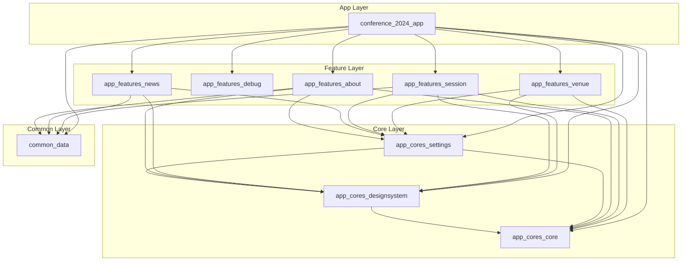

# FlutterKaigi 2024 公式アプリ

まずはじめに [プロジェクトの README] をご覧ください。

## 環境分け

`--dart-define-from-file` オプションを使用して、環境ごとに異なる設定を行っています。

環境は２つ用意しており、設定ファイルは [`defines/`] に配置しています。

| 環境名 | 設定ファイル |
| - | - |
| 開発環境 | [`development.env`] |
| 本番環境 | [`production.env`] |

## 環境ごとの役割

### 開発環境

データベースの構造などを変更しないといけない機能の開発や修正を行う際に使用します。主に FlutterKaigi スタッフがこの環境で開発を行うことを想定しています。

次のように Supabase のローカル環境を構築し、開発を行います。

1. [Docker Desktop] や [OrbStack] などを使用して Docker daemon を起動
1. `supabase start` を実行して Supabase のローカル環境を起動
1. データベースの構造などを変更
1. `supabase reset` などを実行してデータベースの変更を反映
1. アプリを開発環境で起動

なお、必要なコマンドは VS Code のタスクとして実行できるように [`tasks.json`] に設定していますので、VS Code を使用している場合はそちらを利用してください。

参考資料:

- [Supabase DOCS Local Development & CLI]
- [Integrate with External Tools via Tasks]

### 本番環境

基本的にはこちらで開発を行います。

本番の Web API を使用するため、過度に API のリクエストを行わないように注意してください。

## パッケージごとの役割

アプリで使用しているパッケージとその役割は以下の通りです。

| パッケージ名 | 役割 |
| - | - |
| `app_cores_core` | アプリのパッケージ間で共通して使用する機能を提供 |
| `app_cores_designsystem` | アプリのデザインシステムを提供 |
| `app_cores_settings` | アプリの設定関連機能を提供 |
| `app_features_about` | アプリについての説明関連機能を提供 |
| `app_features_debug` | アプリのデバッグ機能を提供 |
| `app_features_news` | アプリのニュース関連機能を提供 |
| `app_features_session` | アプリのセッション関連機能を提供 |
| `app_features_venue` | アプリの会場関連機能を提供 |
| `common_data` | プロジェクト全体で共通して使用するデータ関連機能を提供 |
| `conference_2024_app` | アプリのエントリーポイントを提供 |

## パッケージの依存関係

このプロジェクトでは、各機能やをパッケージ単位で分割し、それぞれが特定のレイヤーに属しています。レイヤー構造は以下の通りです。

1. **App Layer** - アプリ全体を管理し、`Core`・`Feature`・`Common` レイヤーのパッケージに依存することで全体の機能を統合しています。アプリケーションを構築する際、最上位のレイヤーとして、全機能を束ねる役割を担います。
1. **Feature Layer** - ある程度まとまった単位での機能を提供します。`Core`・`Common` レイヤーのパッケージに依存しています。
1. **Core Layer** - アプリ全体で共通して利用するコア機能やデザインシステムを提供します。`App`・`Feature` レイヤーのパッケージが依存する基本的な機能を提供し、アプリの土台を支える役割を果たします。
1. **Common Layer** - 共通データや外部データアクセスを担当するパッケージで、複数のパッケージで利用されるデータソースを管理します。

### 注意事項

- **依存関係の一貫性**: 依存関係は基本的に上位レイヤーが下位レイヤーに依存する形で構成されています。これにより、上位レイヤーの変更が下位レイヤーに影響しないように設計されています。
- **パッケージの分離**: 新しい機能を追加する場合は、可能な限り既存のパッケージに実装することを検討してください。新たにパッケージを作成して分離する場合は、同じレイヤー内での依存をしたり循環依存したりしないように注意してください。
- **共通データの管理**: `Common Layer` に含まれる共通データは、プロジェクト全体で共通して使用されているため、変更する際は影響範囲を慎重に検討してください。アプリのみで共通して使用されるデータは `Core Layer` のパッケージで管理して、各機能で共通して使用されるデータは `Feature Layer` のパッケージで管理するようにしてください。

### 依存関係図

以下は、アプリで使用している各パッケージの依存関係を示す図です。



## ディレクトリ構造

### アプリ全体

```text
.
├── apps/
│   └── app/                   # アプリのエントリーポイントを提供
└── packages/
    ├── app/
    │   ├── cores/
    │   │   ├── core/          # アプリのパッケージ間で共通して使用する機能を提供
    │   │   ├── designsystem/  # アプリのデザインシステムを提供
    │   │   └── settings/      # アプリの設定関連機能を提供
    │   └── features/
    │       ├── about/         # アプリについての説明関連機能を提供
    │       ├── debug/         # アプリのデバッグ機能を提供
    │       ├── news/          # アプリのニュース関連機能を提供
    │       ├── session/       # アプリのセッション関連機能を提供
    │       └── venue/         # アプリの会場関連機能を提供
    └── common/
        └── data/              # プロジェクト全体で共通して使用するデータ関連機能を提供
```

### パッケージごと

パッケージごとに多少異なりますが、基本的には以下のような構造になっています。

```text
packages/
├── app/*/*/
│   └── lib/
│       ├── src/
│       │   ├── data/          # データ層の実装
│       │   ├── gen/           # 生成されたコード
│       │   ├── providers/     # プロバイダーの実装
│       │   ├── routing/       # ルーティングの実装
│       │   └── ui/            # UI部品の実装
│       ├── l10n.dart          # 多言語対応のエクスポート
│       ├── providers.dart     # プロバイダーのエクスポート
│       ├── routing.dart       # ルーティングのエクスポート
│       └── ui.dart            # UI部品のエクスポート
│
└── common/data/
    └── lib/
        ├── src/
        │   ├── model/         # モデルの実装
        │   ├── provider/      # プロバイダーの実装
        │   └── repository/    # リポジトリの実装
        └── *.dart             # 各機能のエクスポート
```

<!-- Links -->

[プロジェクトの README]: ../../README.md

[`defines/`]: ./defines/

[`development.env`]: ./defines/development.env

[`production.env`]: ./defines/production.env

[Docker Desktop]: https://docs.docker.com/desktop/

[OrbStack]: https://orbstack.dev/

[`tasks.json`]: ../../.vscode/tasks.json

[Supabase DOCS Local Development & CLI]: https://supabase.io/docs/guides/local-development

[Integrate with External Tools via Tasks]: https://code.visualstudio.com/docs/editor/tasks
