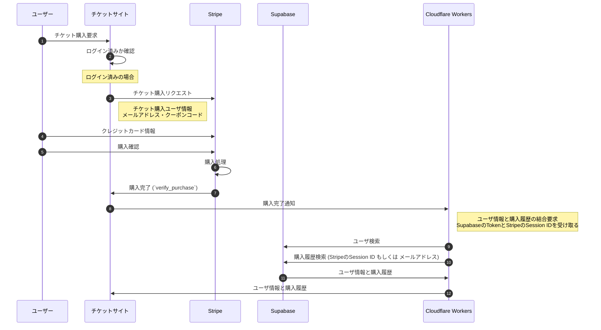

# チケットと購入履歴の結合仕様について

## 概要

チケット購入に際して、Supabaseで管理するアカウントとStripeでの購入履歴を結合する必要がある。

## フロー

```mermaid
sequenceDiagram
    autonumber
    participant U as ユーザー
    participant A as チケットサイト
    participant S as Stripe
    participant D as Supabase
    participant API as Cloudflare Workers

    U->>A: チケット購入要求
    A->>A: ログイン済みか確認
    Note over A: ログイン済みの場合
    A->>S: チケット購入リクエスト
    Note left of S: チケット購入ユーザ情報<br>メールアドレス・クーポンコード
    U->>S: クレジットカード情報
    U->>S: 購入確認
    S->>S: 購入処理

    S->>A: 購入完了 (`verify_purchase`)
    A->>API: 購入完了通知
    Note right of API: ユーザ情報と購入履歴の結合要求<br>SupabaseのTokenとStripeのSession IDを受け取る
    API->>D: ユーザ検索
    API->>D: 購入履歴検索 (StripeのSession ID もしくは メールアドレス)
    D->>API: ユーザ情報と購入履歴
    API->>A: ユーザ情報と購入履歴


```
