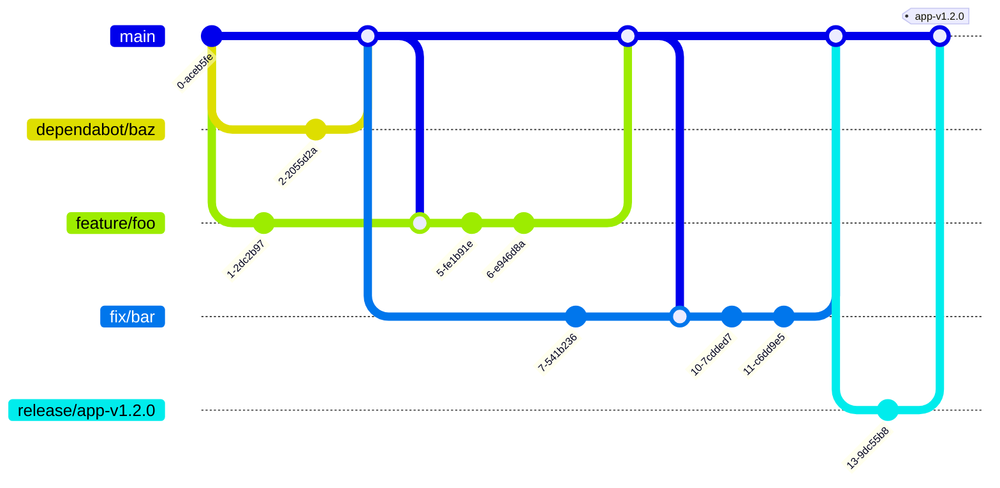

# Git のブランチ戦略

## ブランチについて

| ブランチ | 説明 |
| - | - |
| `main` | デフォルトブランチです。 |
| `feature/{name}` | あたらしい機能を作ります。 |
| `fix/{name}` | 問題を直します。 |
| `improvement/{name}` | いろいろなものをより良くします。 |
| `release/app-v{version}` | アプリをみんなに使ってもらうために、準備をします。 |
| `release/website-v{version}` | ウェブサイトをみんなに使ってもらうために、準備をします。 |
| `dependabot/{target}` | Dependabot が使うので、使うことはありません。 |

## ラベルについて

特定のブランチはプルリクエストを作ると、自動でプルリクエストにラベルが付きます。どのブランチにどのラベルが付くかは `.github/labeler.yaml` で設定されています。

| ブランチ | ラベル |
| - | - |
| `feature/*` | `feature` |
| `fix/*` | `bug` |
| `improvement/*` | `improvement` |
| `release/*` | `release` |

## 例

