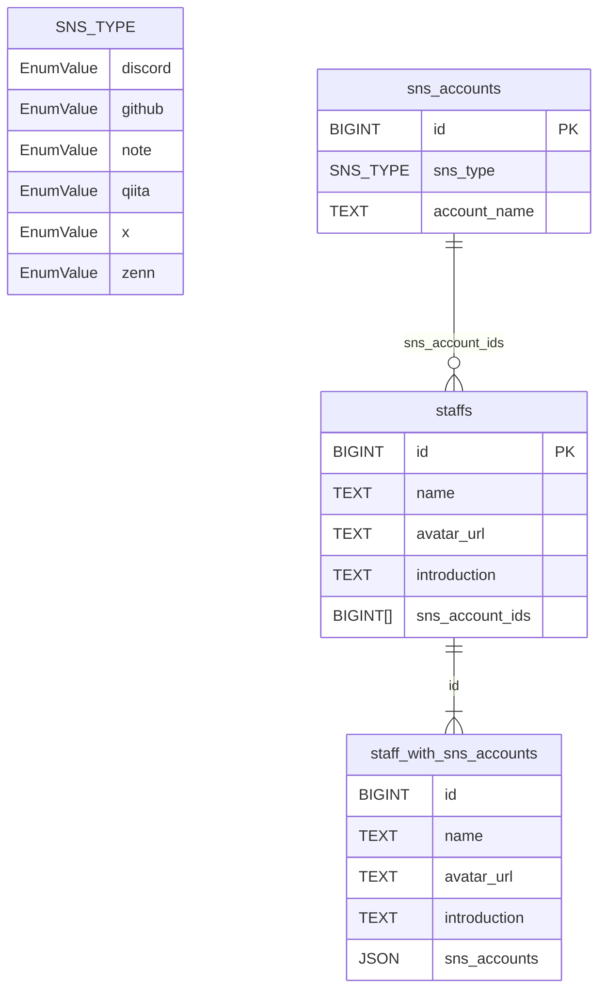

```mermaid
erDiagram
    SNS_TYPE {
        EnumValue discord
        EnumValue github
        EnumValue note
        EnumValue qiita
        EnumValue x
        EnumValue zenn
    }

    sns_accounts {
        BIGINT id PK
        SNS_TYPE sns_type
        TEXT account_name
    }

    staffs {
        BIGINT id PK
        TEXT name
        TEXT avatar_url
        TEXT introduction
        BIGINT[] sns_account_ids
    }

    staff_with_sns_accounts {
        BIGINT id
        TEXT name
        TEXT avatar_url
        TEXT introduction
        JSON sns_accounts
    }

    sns_accounts ||--o{ staffs: "sns_account_ids"
    staffs ||--|{ staff_with_sns_accounts: "id"

```
