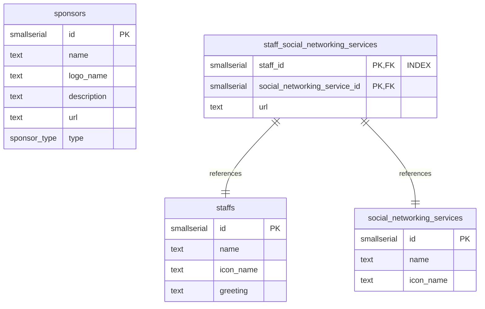

## 概要

FlutterKaigi 2024 では Supabase を使ってデータベースを構築しています。

そのデータベースの ER 図を以下に示します。

## ER 図

> [!NOTE]  
> 後々、以下の ER 図は自動生成する予定です。

```mermaid
erDiagram
    sponsors {
        smallserial id PK
        text name
        text logo_name
        text description
        text url
        sponsor_type type
    }

    staffs {
        smallserial id PK
        text name
        text icon_name
        text greeting
    }

    social_networking_services {
        smallserial id PK
        text name
        text icon_name
    }

    staff_social_networking_services {
        smallserial staff_id PK, FK "INDEX"
        smallserial social_networking_service_id PK, FK
        text url
    }

    staff_social_networking_services ||--|| staffs : "references"
    staff_social_networking_services ||--|| social_networking_services : "references"

```
